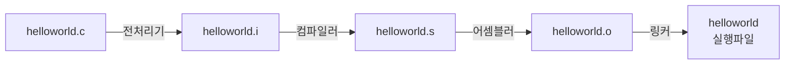

📜Table of Contents📜
===
[폰 노이만 구조](#폰-노이만-구조)&emsp;
[C언어 기본 구조](#c언어-기본-구조)&emsp;
[C언어 컴파일 과정](#c언어-컴파일-과정)
<br>

## 폰 노이만 구조
source from [here](https://yoons2owo.tistory.com/5)<br>
<br>
* [CPU] ← [memory(RAM)] ← [storage(SSD)]
* 연산 수행과 관련하여 기억장치에 저장된 명령어를 통해 CPU에서 연산 수행.
<br><br>

## C언어 기본 구조
source from [here](https://atomic0x90.github.io/c-language/2019/05/23/Characteristics-and-structure-of-language-C.html)
```C
#include<stdio.h>
int main()
{
    printf("Hello, world!");
    return 0;
}
```

<br><br>

## C언어 컴파일 과정

