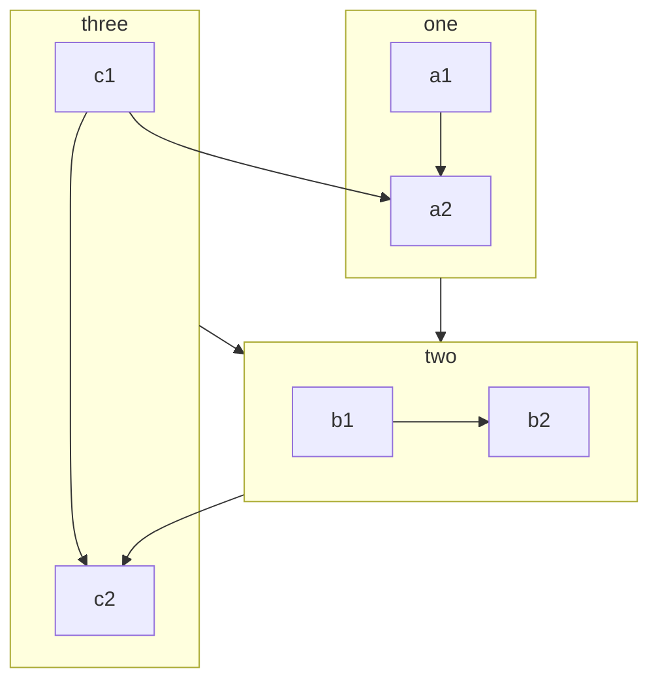

📜Table of Contents📜
===

  
## 폰 노이만 구조

```mermaid
flowchart TB
    c1-->a2
    subgraph one
    a1-->a2
    end
    subgraph two
    b1-->b2
    end
    subgraph three
    c1-->c2
    end

    one --> two
    three --> two
    two --> c2
```
## C언어 컴파일 과정

## C언어 기본 구조
