📜Table of Contents📜
===
[폰 노이만 구조](#폰-노이만-구조)&emsp;
[C언어 기본 구조](#c언어-기본-구조)&emsp;
[C언어 컴파일 과정](#c언어-컴파일-과정)
<br>

## 폰 노이만 구조
source from [here](https://yoons2owo.tistory.com/5)<br>
<br>
* [CPU] ← [memory(RAM)] ← [storage(SSD)]
* 연산 수행과 관련하여 기억장치에 저장된 명령어를 통해 CPU에서 연산 수행.
<br><br>

## C언어 기본 구조
source from [here](https://atomic0x90.github.io/c-language/2019/05/23/Characteristics-and-structure-of-language-C.html) [also here](https://m.blog.naver.com/PostView.naver?isHttpsRedirect=true&blogId=2000pansung&logNo=222135219204)
```C
#include<stdio.h>
int main(void)
{
    printf("Hello, world!");
    return 0;
}
```
```#include<stdio.h>```
--
* ```#```은  [*전처리기preprocessor*](https://ko.wikipedia.org/wiki/C_%EC%A0%84%EC%B2%98%EB%A6%AC%EA%B8%B0)를 의미. 컴파일 전 미리 처리하라는 명령어.
* ```<stdio.h>```은 ```.h``` 확장자를 갖는 [**헤더파일**](https://ko.wikipedia.org/wiki/%ED%97%A4%EB%8D%94_%ED%8C%8C%EC%9D%BC).
  <details>
  <summary>간략한 뜻</summary>
  <div markdown="1">
  소스 코드의 파일. 표준 라이브러리 함수가 전통적으로 헤더 파일 내에 선언됨.
  </details>


<br><br>

## C언어 컴파일 과정

```mermaid
flowchart LR
    A[helloworld.c] -->|전처리기| B[helloworld.i]
    B[helloworld.i] -->|컴파일러| C[helloworld.s]
    C[helloworld.s] -->|어셈블러| D[helloworld.o]
    D[helloworld.o] -->|링커| E[helloworld\n실행파일]
```

